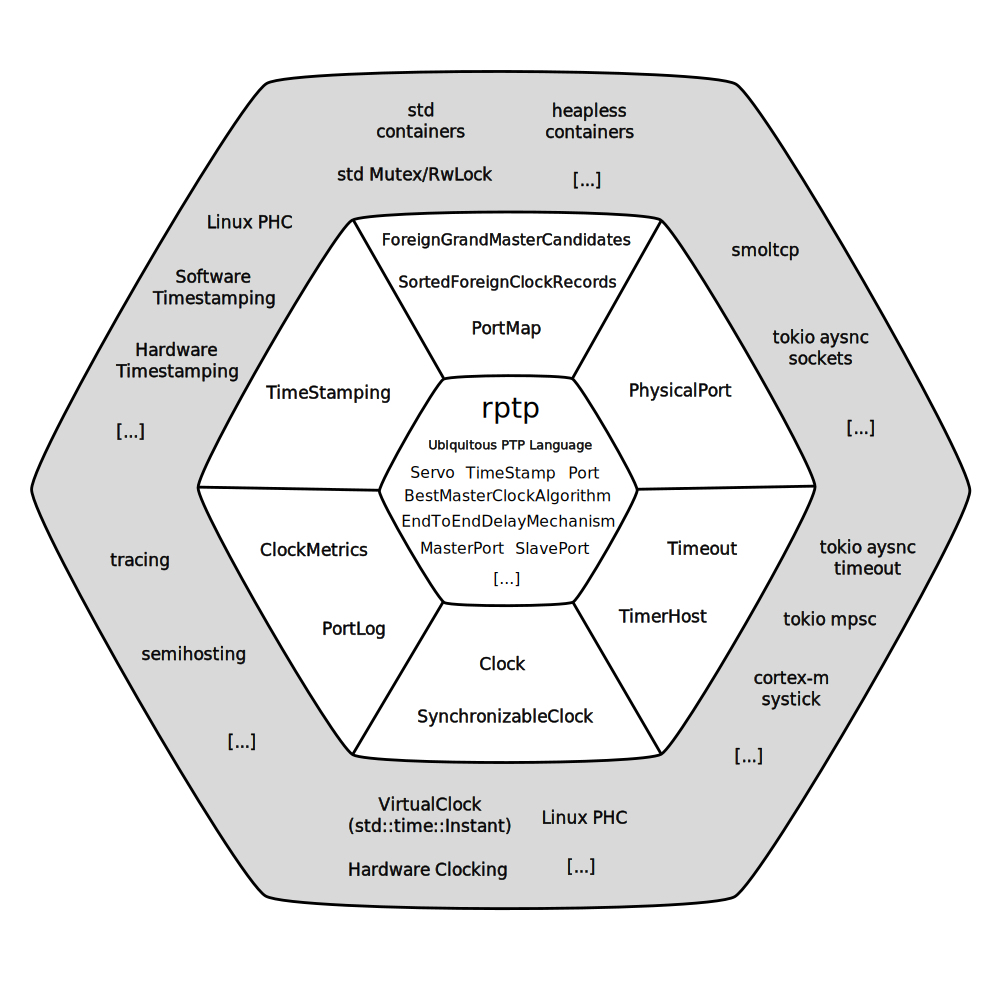

# rptp Architecture Overview

This document describes the high‑level architecture of `rptp`, an IEEE 1588 Precision Time Protocol implementation focused on a clear, behaviour‑rich domain model with a thin, replaceable infrastructure layer.

The goal is to keep time, messages, clocks and ports as the conceptual center of the system, while networking, async runtimes, and hardware timestamping remain peripheral and interchangeable.

> **🚧 Work in progress:** `rptp` is not a production-ready PTP stack.
> Expect incomplete protocol coverage, rough edges, and refactors as the model and tests grow.
> This document evolves with the code and may lag behind in details.

---

## 1. High-Level Structure

This project aims for a clean split between:

* A runtime- and infrastructure-agnostic (no_std) domain model of PTP (`crates/rptp`) with a strong focus on behavioural modeling
* Interchangeable runtime/infrastructure layers.

At the current stage of development, the focus is clearly on the domain core.
The main purpose of the infrastructure layers (`crates/rptp-daemon`, `crates/rptp-embedded-demo`) in their current shape is to provide just enough integration and feedback as needed to drive the core design forward.
Later on, `rptp-daemon` is planned to evolve into a full-grown daemon, and `rptp-embedded-demo` into a full bare-metal reference implementation.

To keep the domain core runtime- and infrastructure-agnostic, `rptp` defines a couple of domain-facing traits.
Part of that story is to encapsulate storage and collections behind a surface of domain meaning (e.g. `trait ForeignGrandMasterCandidates`), not a surface of infrastructure abstractions and plumbing (`Vec`, `HashMap`, ...).
Infrastructure is free to use `Vec`/`HashMap`/etc. behind those traits; while the core shouldn't depend on those choices.
See "Growing Object-Oriented Software, Guided by Tests" by Steve Freeman & Nat Pryce, Chapter 13.

The general design rule is: infrastructure layers compose domain objects into high-level constructs such as ordinary or boundary clocks.
Outer layers always point to inner layer constructs, but inner domain objects never see the outer layers.
The following figure shows the hexagonal architecture, with the core domain and its domain-facing adapter traits, surrounded by possible infrastructure counterparts for those adapter traits.



---

## 2. Practical Tour: How the Current Code Works

The previous sections are intentionally high-level.
This section is a pragmatic “walk the code” tour of what exists today.

### 2.1 Bytes → domain messages → port roles

In the Tokio daemon, raw datagrams are received in `TokioPortsLoop` (`crates/rptp-daemon/src/node.rs`) and forwarded into the domain via `MessageIngress`:

```
UDP datagram bytes
   |
   v
MessageIngress::receive_event / receive_general   (crates/rptp/src/message.rs)
   |
   v
PortMap::port_by_domain(domainNumber)             (crates/rptp/src/port.rs)
   |
   v
PortIngress::process_*                            (crates/rptp/src/port.rs)
   |
   v
PortState::{dispatch_*, apply(decision)}          (crates/rptp/src/portstate.rs)
   |
   v
state object behaviour (Listening/Master/Slave/...) (crates/rptp/src/[master|slave|...].rs)
```

#### Message Processing Collaborators:
* **MessageIngress**
  * Does the minimal message validation needed (length, version) by transforming raw bytes into intermediate objects **UnvalidatedMessage** and **LengthCheckedMessage**, and finally into a `DomainMessage` object (literally "a message in a domain").
    This message knows its domain and knows how to dispatch itself to a port using a `PortMap`.
* **PortMap**
  * Infrastructure-supplied mapping of domains to ports, see Section 4 ("Structure vs Behaviour").
* **PortIngress**
  * The actual mutable boundary between domain message input and the port states.
    Encapsulates the application and mutation of the port state based on state decisions.
* **PortState**
  * The actual state machine along with the definition of its allowed transitions and the port-state-specific message dispatch matrix.
* **ListeningPort, MasterPort, SlavePort, ...**
  * Port states modeled as distinct types.
    So port state is not a variable, not data, not a mutable integer field, but more like a role an inner `Port` object steps out and into, see the "Ports as Roles" section below.

#### `PortProfile`: policy + assembly (early PTP profile hook)

Port states aim to stay focused on protocol behaviour and avoid turning into configuration carriers.
The `PortProfile` object (`crates/rptp/src/profile.rs`) holds port-level timing policies (log intervals, timeout intervals) and performs the trivial assembly work to produce fully wired port role instances (timeouts, cycles, delay mechanism) as a `PortState`.

This is an early design hook for later support of PTP profiles: a profile can become the single place where profile-specific timing and policy decisions live, while the individual port state types remain cohesive and primarily concerned with behaviour.

### 2.2 Timestamping: where time enters

Two different time inputs are used in the current design:

- **Ingress PTP timestamps for event messages** (Sync/DelayReq/…) are supplied by platform-dependent infrastructure when calling `MessageIngress::receive_event(...)`.
  PTP timestamps are represented by `TimeStamp` in `crates/rptp/src/time.rs`.
- **Monotonic local instants for general messages** (Announce/FollowUp/DelayResp/…) are currently passed as an `Instant` to `MessageIngress::receive_general(...)`.
  These instants represent local monotonic system time; they are comparable and most often derived from `std::time::Instant` on `std`-enabled platforms.
  They are used most prominently for time window-based announce message qualification.

On egress, event message timestamping is pluggable as well.
`DomainPort` delegates to a `TxTimestamping` collaborator after successfully sending an event message.
Infrastructure is then responsible for feeding back egress timestamps (synchronously or asynchronously) along with the associated egress message.

### 2.3 “Ports as Roles” around `DomainPort`

Ports are modeled in two layers:

- `DomainPort` is literally “a port in a domain”: it knows its domain and has identity, can build message buffers out of event and general messages to be sent on the wire, can schedule timeouts via `TimerHost`, and can log.
- Port state objects (ListeningPort, MasterPort, SlavePort, …) own protocol behaviour, but delegate I/O and timers to the wrapped `Port` object (implemented by `DomainPort`).
  They are like roles the encapsulated basic port steps in and out. Like capabilities it picks up and drops as the current context demands.

The key point of object modeling here is autonomy: BMCA decides about the context, port states decide about the role/capability change to react accordingly.
This reduces overly procedural and imperative command-and-control code, manager and controller constructs, as well as overly defensive programming and current state checks spread all over the place.
Current state checks are confined to a single place (enum `PortState`).

#### Port States and Transition Move Cost

`PortState` is defined as an enumeration of rich, non-trivial port state types.
Therefore, a state transition involves moving the inner port and some collaborators out of the old state, and moving them back into the new state again. Baton-passing, or better, baton-moving.
This happens in the `PortIngress` implementation for `Option<PortState<'a, P, S>>` (`crates/rptp/src/port.rs`) and is expressed as by-value moves of the state machine object on transitions.
Depending on compiler optimizations and concrete state sizes, those moves may compile down to copying bytes (or less), but the important point is: a transition replaces the owned state value rather than mutating a shared “current state” field.
Considering the current size of port state types, this is considered acceptable as transitions are not considered hot path.
Message processing paths are considered hot, which is why the design went from an early consuming `self` and returning `Self` pattern to a pattern of in-place mutation (`&mut self`) for message processing.

Two advantages of this approach:
* It buys us much clarity in the design, as port state collaborators (e.g. `EndToEndDelayMechanism`) are kept close to the port state behaviour.
* The same locality in the design results in actual memory locality of those frequently accessed collaborators.

This tradeoff (transition moves vs. clarity/locality in steady-state processing) is subject to constant review as the design grows.

### 2.4 BMCA and “BMCA roles”

BMCA (Best Master Clock Algorithm) is expressed as a collaboration of small objects, not as a single “run BMCA now” function.

#### Inputs: Announce messages, accumulated over time

- An incoming `AnnounceMessage` carries a foreign clock dataset (`ClockDS`), which it feeds (`feed_bmca()`) into objects implementing the `Bmca` trait.
- `Bmca` objects keep records of foreign clocks seen through announce messages in a store behind `ForeignClockRecords` (chosen by the infrastructure: `Vec`, heapless, etc.).
- Records are qualified or considered stale by collaborating with `SlidingWindowQualification`, which encodes the time window-based qualification rules.

#### Core decision: local candidate vs. foreign candidates

At the center is `struct BestMasterClockAlgorithm`.
It implements the core BMCA algorithm defined by the spec.
In order to fulfil its responsibilities, it is given two clock-level shared collaborators: the local grandmaster candidate, and a collection of foreign grandmaster candidates that can be asked for the best known foreign grandmaster in the domain.
They essentially represent "D_0" and "E_best" in the BMCA decision flow chart.

The algorithm produces a high-level `BmcaDecision`, which then can be applied by the port states:

- `Master(BmcaMasterDecision)` (including the decision point and grandmaster id),
- `Slave(ParentPortIdentity)`,
- `Passive`.

#### BMCA roles: same algorithm, different context and gating

BMCA “roles” are wrappers that encapsulate what a port state needs to know in terms of decision-making.
That's because in the spec's port state chart, transitions do not happen on every BMCA recommendation, but they are gated by parent port or grandmaster clock identities.
So for example, when the spec annotates a transition with `recommended_state == BMC_SLAVE && new_master != old_master`, it represents an implicit concept that even the spec does not name explicitly.
It's the concept of tracking.
`rptp` makes the concept of tracking explicit by introducing BMCA roles wrapping the core `BestMasterClockAlgorithm`, stacking those distinct responsibilities on top of it while leaving the inner core `BestMasterClockAlgorithm` untouched and true to the spec.

- `ListeningBmca`: only produces a decision once a qualified foreign dataset exists (listening state should not thrash based on empty candidate sets).
- `ParentTrackingBmca`: carries the currently tracked parent port identity.
  It gates decisions of the underlying `BestMasterClockAlgorithm` by checking whether the observed parent matches (stability while tracking a parent).
  As `ParentTrackingBmca` is the authority on the parent port identity, uncalibrated or slave ports collaborate with it to filter Sync/FollowUp/DelayResp messages as well, and only accept messages from the currently tracked parent.
- `GrandMasterTrackingBmca`: carries an expected grandmaster identity and gates decisions based on whether the observed grandmaster matches (stability while tracking a grandmaster).

In other words: BMCA roles make the “current context” explicit as an object, instead of scattering context checks across port state code.

#### Boundary clock note (WIP)

The collaboration seams are already shaped toward boundary clocks (per-port BMCA inputs, shared clock-level collaborators), but multi-port is not complete yet.
For example, some `ForeignGrandMasterCandidates` helpers currently assume a single port (`PortNumber == 1`).

### 2.5 Clock discipline

Clock discipline is a bigger story than “just the servo”.
In `rptp`, it is modeled as a pipeline of collaborating objects:

1. Message exchanges are interpreted into an offset estimate,
2. The clock/servo decides what to do about that estimate (step vs. adjust),
3. The port role uses the resulting servo state as part of its state machine decisions.

#### From message exchanges to a `ServoSample`

The servo does not observe raw packets directly.
Port roles build a `ServoSample` from message exchanges using the end-to-end delay mechanism (`EndToEndDelayMechanism` in `crates/rptp/src/e2e.rs`):

- **Sync exchange**: one-step Sync, or two-step Sync + FollowUp.
- **Delay exchange**: DelayReq + DelayResp.

Internally, this is decomposed into exchange objects (rather than a single “compute offset” method):

- `SyncExchange` + `DelayExchange` each track the respective message pairs (two-step & follow-up, delay request & response).
- `MessageWindow` as a private collaborator to message exchanges holds the “latest matching pair” logic for out-of-order or delayed arrivals.
- `EndToEndDelayMechanism` composes message exchanges into a factory for `ServoSample`s that are constructed from observed offset and path-delay estimates provided by each message exchange for each direction.

The output is a `ServoSample(ingress_timestamp, offset)`, representing “at ingress time T, we think our clock was offset by X”.

#### Feeding the local clock (the discipline boundary)

Port roles like `SlavePort` and `UncalibratedPort` call `LocalClock::discipline(sample)` when a sample becomes available (`crates/rptp/src/slave.rs`, `crates/rptp/src/uncalibrated.rs`).

`LocalClock` (`crates/rptp/src/clock.rs`) is the capability boundary for clock control:

- it owns a `SynchronizableClock` backend (how to `now()`, `step()`, `adjust()`),
- it owns a `Servo` strategy (how to turn samples into actions),
- and it returns a `ServoState` (`Unlocked`/`Calibrating`/`Locked`) back to the port role.

That makes “discipline the clock” a single explicit operation, independent of the runtime or clock backend.

```
Sync/FollowUp + DelayReq/DelayResp
              |
              v
EndToEndDelayMechanism::sample()
              |
              v
ServoSample(ingress_timestamp, offset)
              |
              v
LocalClock::discipline(sample)
              |
              v
Servo::feed(...)  ->  step/adjust + ServoState
```

#### Servo strategies as collaborators

The servo itself is a strategy enum (`crates/rptp/src/servo.rs`):

- `SteppingServo`: the simplest strategy; each sample results in a hard step to the estimated master time (`master_estimate`).
  This is useful for early modeling and deterministic tests.
- `PiServo`: a staged strategy that separates stepping, drift calibration, and steady-state PI control.

`PiServo` is intentionally decomposed into narrow collaborators:

- `StepPolicy`: decides whether to step based on thresholds (with a special “first update” threshold).
- `ServoDriftEstimate`: estimates drift from spaced samples (minimum delta, clamping, reset on out-of-order inputs).
- `PiLoop`: integrates error and adjusts clock rate.

This keeps the servo “object rich”: each piece can be tested and tuned independently, and the integration surface stays small (`ServoSample` in, `step/adjust` out).

#### How servo state feeds back into port behaviour

The servo state is not just a metric; port roles use it to decide state transitions:

- In `UncalibratedPort`, reaching `ServoState::Locked` can trigger `MasterClockSelected` (i.e. “we are now disciplined enough to commit to the selected master”).
- In `SlavePort`, failure to stay locked is currently treated as a synchronization fault path.

So clock discipline is a collaboration between exchanges, servo, and the port state machine—not a subsystem bolted on the side.

## 3. General Implementation Considerations

This section captures a few cross-cutting considerations that shape the implementation and contributor expectations.
They’re not “more domain theory”, but they do influence how the domain model is expressed (construction style, error handling, tests, and evolution).

### 3.1 Fail‑Fast vs Fail‑Safe

At this early stage, the project deliberately distinguishes between:

- **Fail‑Fast Domain Core**  
  - The core aims to be loud and explicit when invariants are violated.
  - We do not over‑defend against logically impossible states: if a dataset is inconsistent or a transition is illegal, we would rather panic or surface a clear error than silently continue.
  - This keeps the domain model sharp and makes violations visible during development and testing.

- **Fail‑Safe Boundaries**  
  - At the edges (network I/O, parsing, hardware timestamping), the system is defensive:
    malformed packets, unsupported protocol versions, and unknown domains are logged and dropped without compromising the core.
  - For example, a core `TimeStamp` is never built directly from untrusted input; it is created only once data has been validated and normalized at the boundary.

This split reflects the project’s current priorities: **discover and refine the domain model first**, then introduce more graceful error paths for production environments where panics are unacceptable.

### 3.2 Constructor Injection
This project prefers **constructor injection**: objects shall be created with everything they need to be valid and usable immediately.

#### Why it helps (practically)

Constructor injection has several concrete benefits in this codebase:

- **Less temporal coupling:** behaviour does not depend on calling `init()`/`set_*()` methods in the “right order” before an object becomes valid.
- **Explicit invariants:** required collaborators become constructor parameters (instead of `Option` fields plus runtime checks), making invalid states harder to represent.
- **Less semantic coupling:** readers don’t need “tribal knowledge” about which fields must be set eventually; the meaning is encoded at construction time.
- **Better testability:** tests can assemble valid objects in one place without half-initialized fixtures or global wiring.
- **Refactor safety:** when a dependency becomes required, the compiler forces every construction site to acknowledge the new requirement.
- **Clearer boundaries:** dependencies are passed in, not pulled from registries/singletons/globals.
- **Rust-friendly lifetimes/ownership:** construction-time wiring tends to align with ownership/borrowing, reducing the need for shared mutable state and complex lifecycle staging.

#### Domain meaning: required collaborators are not optional

In the PTP domain, some relationships are not “configuration” but **definition**:

- A slave port without a parent is not “a slave port with missing data”; it’s simply not a slave port.
- That means “having a parent” should not be modeled as `Option<ParentPortIdentity>` plus a setter.

Concrete example from the core: `ParentTrackingBmca` is constructed from a `ParentPortIdentity`, not from an `Option<ParentPortIdentity>` (`crates/rptp/src/bmca.rs`).

This reduces defensive programming inside domain code: the role can assume its invariants and focus on behaviour.

#### No setter injection: a new parent implies a new role

Constructor injection goes hand in hand with a “no setters for identity” rule:

- If the parent changes, the domain meaning changes.
- In `rptp`, that is modeled as a **role change**: a `PortState::apply(...)` transition produces a new role instance wired to the new tracking context, instead of mutating an existing object via `set_parent(...)`.

This fits the overall “ports as roles” approach: a port doesn’t keep a mutable “current parent” field; it replaces the role object whose identity depends on that parent.

#### Infrastructure wiring: dependencies enter at construction time

The same principle applies at the domain/infrastructure boundary: a port state machine is created by injecting the required infrastructure adapters up front (physical send path, timer host, timestamping, logging, foreign record storage).
That makes the constructed port immediately drivable by infrastructure and keeps the domain free from global registries and late wiring.

### 3.3 Code‑Free Constructors

Constructors in `rptp` are designed to be **as behaviour‑free as possible**:

- Constructors construct objects and enforce invariants; they shall **not trigger side effects** like:
  - Start background tasks.
  - Perform I/O.
  - Implicitly or silently change local or global state.

- Behaviour shall be only triggered through **method calls** or **message passing** after construction.

Benefits of this approach:

- **Clarity:**  
  It is always clear what a constructor does and does not do.

- **Composability:**  
  Complex behaviour is built by wiring simple objects together, not by hiding side effects inside constructors.

- **Testability:**  
  Test helpers can assemble realistic graphs of clocks, ports, BMCA, and servos without accidentally duplicating domain logic or triggering hidden behaviour.

This style aligns with the project’s object‑ and behaviour‑centric philosophy described in `design-philosophy.md`.

### 3.4 Testing and Simulation

The architecture is intentionally test‑friendly:

- **Fake and Virtual Components**  
  - `FakeClock`, `FakeTimestamping`, and `FakeNetworkSocket` provide deterministic, in‑memory stand‑ins for hardware and network behaviour.
  - `VirtualClock` allows controlled progression of time in tests.

- **Runtime‑Agnostic Domain Tests**  
  Many domain behaviours can be tested without Tokio at all, using only domain types and fake clocks/timers.

- **End‑to‑End Acceptance Tests**  
  The tests in `tests/e2e` set up different container scenarios that act as end-to-end acceptance tests.
  Another way to frame them is "smoke tests".
  They are not intended to test every corner case, but the most common use cases end-to-end, meaning with a full network topology, network stack and OS/embedded environments beneath.
  Just like smoke tests in electrical engineering, the signal they give is simple: if they go up in smoke, QA engineers don't need to bother with that version at all.
  Those tests deliver this signal in minutes, not hours or days, before QA engineers or customers themselves find out that something is fundamentally broken.

This combination makes it practical to evolve the domain model while keeping confidence in correctness and robustness.

---

## 4. Structure vs Behaviour

> 🚧 This section refers to upcoming features such as multi-port setups to support boundary clocks.
> However, recent refactors already prepare the code for boundary clocks and some mechanisms are already in place.
> The current core is largely single-port-oriented (e.g. some BMCA helpers assume `PortNumber == 1`), but the collaboration seams are already shaped around “shared clock-level collaborators + per-port state machines”.

The design deliberately keeps “how ports are stored and scheduled” outside the domain core, because the domain and infrastructure, as well as different infrastructures themselves have very different requirements:

- Using Tokio, we may have a number of distinct loops/tasks per port, or per interface.
- Embedded firmware often prefers a single static wiring with a tick/IRQ-driven superloop.
- Tests often want deterministic in-memory fakes.

Say we did a structural analysis and decomposition of the problem domain:
```
+--------------------------------+
| BoundaryClock                  |
|--------------------------------|
| local_clock                    |
| foreign_grandmaster_candidates |
| ...                            |
| ports: Vec<Port>               |
+--------------------------------+
| get_port(u16) -> &Port         |
+--------------------------------+
```
How would we drive each port?
How to wire ports to physical ports, to actual interface-bound sockets?
What if two clocks had ports on the same interface, but each in a different domain?
The domain core would need to expose this structure (e.g. `get_port`) to the infrastructure layer, which would weaken encapsulation by turning an internal organization decision (how ports are stored/located) into a public API contract. 
Plus, the infrastructure layer would need to build a second structure (how ports relate to sockets) and a possibly complex and error-prone wiring, plumbing, and mapping between the two structures.
Furthermore, this leaves the risk of leaking or repeating domain logic into the infrastructure.
The other way around, it may leak infrastructure mechanics into the core, like polling or waiting for I/O.

Therefore, the domain core does not *lead* with a structural decomposition here (especially not one that exposes port storage and lookup to the outer layers), but with a behavioural one.
Clocks expose ports as behaviour, through factory methods, establishing the behavioural relationship between a clock and its ports at port construction time, leaving structural decisions of how and where to store ports and how to drive them to the infrastructure.
The clocks become merely owners of shared state the ports refer to on BMCA decisions or clock discipline, as shown in the diagram below:
```
+-------------------------------------------------+
| BoundaryClock                                   |
|-------------------------------------------------|
| local_clock                                     |
| foreign_grandmaster_candidates                  |
| other_shared_port_collaborators                 |
+-------------------------------------------------+
| port(&self, port_number, adapters) -> PortState |
+-------------------------------------------------+
```

In the current codebase this “port” is represented as a port state machine value (`PortState`), driven through the `PortIngress` interface.
The important point is: it’s returned as an owned value, and infrastructure decides where and how to store and schedule it.

### 4.1 Example: Boundary clock ports owned by separate event loops (eth0 + eth1)

This example sketches two domains (0 and 1), each with its own boundary clock.
Each boundary clock exposes two ports.

In this particular wiring, infrastructure stores ports in per-interface event loops: one loop services sockets on `eth0`, and one services sockets on `eth1`.
Each port is bound to the corresponding interface (and thus to distinct event/general socket pairs).

```
  +----------------------------------+              +----------------------------------+
  | BoundaryClock (domain 0)         |              | BoundaryClock (domain 1)         |
  |----------------------------------|              |----------------------------------|
  | LocalClock (shared across ports) |              | LocalClock (shared across ports) |
  | datasets / BMCA context          |              | datasets / BMCA context          |
  +-----------------+----------------+              +-----------------+----------------+
                    |                                                 |
                    |         create ports / port states owned        |
                    |  by the per-interface tasks, not by the clocks  |

         port(&self, 1, &eth0)                              port(&self, 1, &eth0)
         port(&self, 2, &eth1)                              port(&self, 2, &eth1)

                    |                                                 |
                    |                                                 |
                    |          +--------------------------------------+------------+
                    |          |                                                   |
                    |          |                                                   |
          +---------+----------|-------------------------+                         |
          |                    |                         |                         |
          v                    v                         v                         v
+------------------------------------+              +------------------------------------+
| Tokio Task (eth0)                  |              | Tokio Task (eth1)                  |
|------------------------------------|              |------------------------------------|
| event socket: 319 / eth0           |              | event socket: 319 / eth1           |
| general socket: 320 / eth0         |              | general socket: 320 / eth1         |
| timer host / timeouts              |              | timer host / timeouts              |
| PortMap(domain->PortIngress)       |              | PortMap(domain->PortIngress)       |
|------------------------------------|              |------------------------------------|
| owns: PortState (port 1, domain 0) |              | owns: PortState (port 2, domain 0) |
| owns: PortState (port 1, domain 1) |              | owns: PortState (port 2, domain 1) |
|------------------------------------|              |------------------------------------|
| recv bytes -> MessageIngress       |              | recv bytes -> MessageIngress       |
|            -> PortIngress          |              |            -> PortIngress          |
+------------------------------------+              +------------------------------------+
                  ^                                                   ^
                  |                                                   |
            PTP traffic on eth0                                 PTP traffic on eth1
```

A wiring like in the example above shall translate into code like the snippet below.
This is just one possible wiring.
Other environments and infrastructure layers may wire things up differently, as it is already the case in the Tokio-based rptp-daemon and in the cortex-m embedded bare metal demo with just single-port ordinary clocks.

```rust
// Simplified pseudo-ish code mirroring the diagram above.

// create infrastructure upfront (sockets, adapters, ...)
let (eth0_event, eth0_general) = /* create event and general socket for eth0 */
let (eth1_event, eth1_general) = /* create event and general socket for eth1 */

// domain adapters (impl PhysicalPort)
let eth0 = TokioPhysicalPort(eth0_event, eth0_general);
let eth1 = TokioPhysicalPort(eth1_event, eth1_general);
// other adapters ...

// create domain clock objects
let clock_d0 = BoundaryClock::new(LocalClock::new(...), DomainNumber::new(0));
let clock_d1 = BoundaryClock::new(LocalClock::new(...), DomainNumber::new(1));

// Actual port(-state) storage is an infra-*structure* decision.
let port_map_eth0 = HashMap::new();
let port_map_eth1 = HashMap::new();

// Map the first port of each clock to eth0
port_map_eth0.insert(clock_d0.domain(), clock_d0.port(PortNumber::new(1), &eth0, ...));
port_map_eth0.insert(clock_d1.domain(), clock_d1.port(PortNumber::new(1), &eth0, ...));

// Map the second port of each clock to eth1
port_map_eth1.insert(clock_d0.domain(), clock_d0.port(PortNumber::new(2), &eth1, ...));
port_map_eth1.insert(clock_d1.domain(), clock_d1.port(PortNumber::new(2), &eth1, ...));

// First event loop drives all ports mapped to eth0, one port per domain
let eth0_loop = TokioPortsLoop(eth0_event, eth0_general, port_map_eth0);

// Second event loop drives all ports mapped to eth1, one port per domain.
let eth1_loop = TokioPortsLoop(eth1_event, eth1_general, port_map_eth1);

// Run both event loops tasks concurrently
tokio::try_join!(eth0_loop.run(), eth1_loop.run())?;
```

---

## 5. Evolution and Extensibility

The current architecture is intentionally conservative and biased toward clarity.
It is designed to evolve in several directions without compromising the core:

- Multiple domains and ports, beyond the simple single‑domain setups in early tests.
- Swappable timestamping backends for different NICs and platforms.
- Support for different PTP profiles and deployment policies.
- Additional runtimes (embedded, no‑std, custom executors) implementing the same traits.

Because the domain core is isolated from infrastructure and the runtime traits are small and semantic, these extensions can be introduced incrementally while preserving the integrity of the model.

This document should be updated as the system evolves, but the guiding principle remains:  
**the domain model leads; infrastructure follows.**
